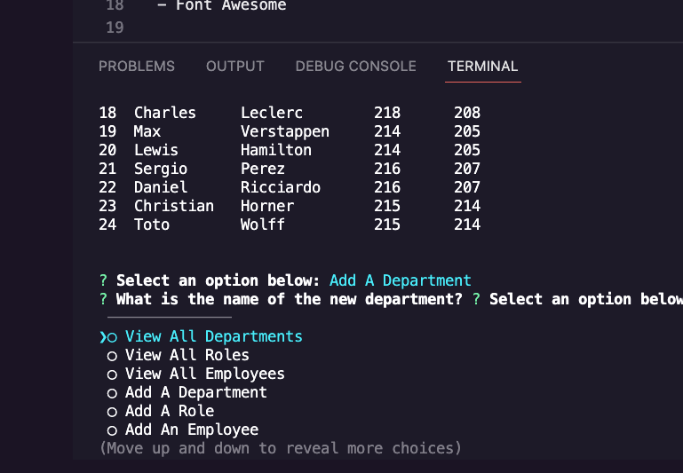

# WORKER DBEE EMPLOYEE TRACKER DATABASE

## Description

Utilizing mySQL, this application allows the user to access and edit an employee database via the CLI.

## Installation

Open a command line interface and type node index.js to start the application.

## Usage

## Credits

N/A

## License

